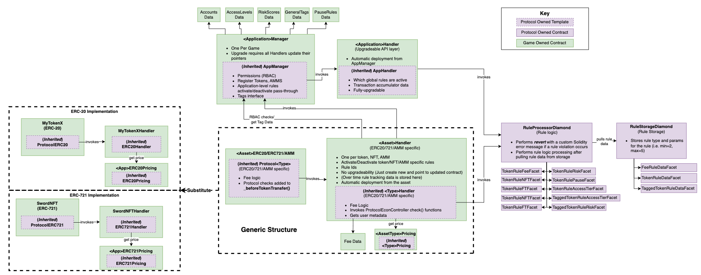
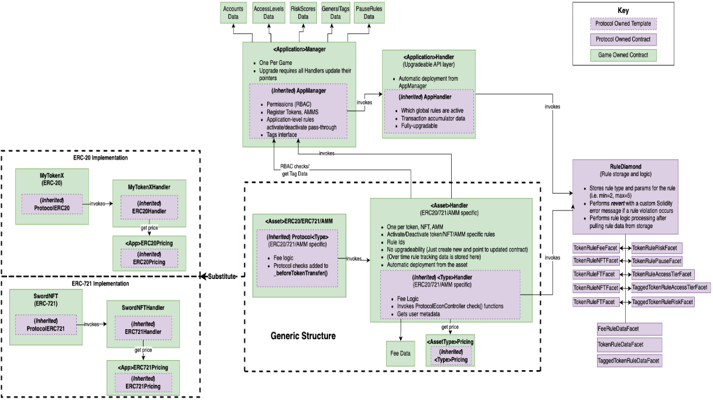

# High Level Overview: Rules Protocol
[![Project Version][version-image]][version-url]

## Table of Contents

- [Glossary](#glossary)
- [Diamond Pattern](#diamond-pattern)
- [Architecture Overview](#architecture-overview)
- [Rules](#how-rules-work)
    - [How Rules Work](#how-rules-work)
    - [Rule Applicability](#rule-applicability)
    - [Rule Applicability Controls](#rule-applicibility-controls)
        - [Protocol Tags Structure](#protocol-tags-structure)
        - [Access Level Structure](#access-level-structure)
        - [Risk Scores](#risk-scores)
- [Application Handler](#application-handler)
    - [Application Level Rules](#application-level-rules)
    - [Rule Functions](#rule-functions)
- [Application Manager](#application-manager)
    - [Admin Roles](#admin-roles)
    - [Access Levels, Risk Scores and Tags](#access-levels-risk-scores-and-tags)
    - [Associated Contracts](#associated-contracts)
- [Protocol Asset Handler Diamond Structure](#protocol-asset-handler-diamond-structure)
    - [Common Contracts](#common-contracts)
    - [Protocol ERC 20](#protocol-erc-20)
    - [Protocol ERC 721](#protocol-erc-721)
- [Protocol Rule Processor Diamond](#protocol-rule-processor-diamond)
    - [Protocol Rule Processor Diamond Facets](#protocol-rule-processor-diamond-facets)
    - [Protocol Rule Processor Diamond Libraries](#protocol-rule-processor-diamond-libraries)
- [Protocol Fee Structure](#protocol-fee-structure)
    - [Fees Evaluation](#fees-evaluation)
    - [Transfer Fee](#transfer-fee)
- [Oracle Configuration](#oracle-configuration)
    - [Approval List Oracle](#approval-list-oracle)
    - [Denial List Oracle](#denial-list-oracle)
    - [External Oracle](#external-oracle)
    - [Oracle Rules](#oracle-rules)
- [Pricing Contracts](#pricing-contracts)
    - [Price Format](#price-format)
        - [ERC20s](#erc20s)
        - [ERC721s](#erc721s)
    - [Third-Party Solutions](#third-party-solutions)
- [Documentation maintenance](#documentation-maintenance)
    - [Manually Generated Documentation](#manually-generated-documentation)
    - [Auto-generated Documentation](#auto-generated-documentation)

## Purpose

This document offers a high level overview of the rules protocol - what it does and how it works. Read this to gain an initial understanding of the repo and the structure of the rules protocol.

## Glossary

| Term                      | Definition                                                                                                                                                  |
|:--------------------------|:------------------------------------------------------------------------------------------------------------------------------------------------------------|
| AppManager                | An appliction-associated smart contract acting as a central hub for managing the application it is associated with. Allows for creation/maintenance of permission roles, application rules, pause windows, and user account metadata. Can be utilized for both updating and checking an account's role in relation to the application.|
| ApplicationHandler        | An application-associated smart contract supporting the AppManager contract by storing the application level rules data and functions. This is the connection to the Rules Protocol for the AppManager, assessesing and reading the rules that are activated for an application. |
| AssetHandler | The Protocol Asset Handler Diamond serves as the access point to the protocol for a protocol supported asset. The protocol supported asset stores the Handler Diamond proxy address and uses it to call the `check all rules function`. The Handler Diamond stores all asset level rule data, rule activation status, and connects the token to the AppManager for role based access control.        |
| Pricing Module            | Application-associated smart contract(s) serving as token-price data sources for ecosystem applications. The pricing module can be found in 2 different categories: ERC20 and ERC721. Any custom-made pricing contract that intends to be protocol compliant must implement the IProtocolERC20Pricing and/or IProtocolERC721Pricing interface(s).                            |
| Protocol Supported ERC721 | An ERC721 token that implements the protocol ProtocolERC721 or the protocol hook.                                                                                                |
| Protocol Supported ERC20  | An ERC20 token that implements the protocol ProtocolERC20 or the protocol hook.                                                                                                |
| Access-Level Provider     | An external provider that rates or segments users based on external criteria for access level solutions. Default access level mechanisms allow developers to set user access levels.        |
| Permission Roles          | Roles used by AppManager. They include: Admin, Access Level Admin, Risk Admin, Rule Admin, and Treasury Account.                                                                            |
| Application Rule          | Rule applied to all protocol supported assets. They are created using the protocol's RuleProcessorDiamond and applied in the application's AppManager.        |
| Token Specific Rule       | Rule applied to a specific protocol supported entity. They are created using the protocol's RuleProcessorDiamond and applied in the token's Handler.        |
| Tag | Bytes32 strings that can be attached to accounts via AppManager. Think of it as labels or badges that accounts can have. |

## Diamond Pattern

This protocol uses the _diamond_ pattern. The diamond pattern allows the handler to add new features and improvements through the use of an upgradable proxy contract. New facet contracts can be deployed and connected to the diamond via a specialized function called diamondCut. New facets and functions allow the handler to grow while maintaining address immutability with the proxy contract. Calling contracts will only need to set the address of the diamond proxy at deployment, without having to worry about that address changing over time. The Handler Diamond follows ERC 2535 standards for storage and functions. 
#### *[ERC 2535: Diamond Proxies](https://eips.ethereum.org/EIPS/eip-2535)*

## Architecture Overview

The following diagram outlines the general architecture of the protocol. Every application
ecosystem may reuse the purple contracts. These contracts are also in a configuration that allows for upgradability. Each 
ecosystem must deploy the green contracts. 


The following diagram outlines a sample deployment: 


## How Rules Work 

The protocol allows [rule administrators](./userGuides/permissions/ADMIN-ROLES.md) to add rules to the Rule Processor Diamond. The rule id generated by the protocol is then used within an application to apply to user [economic actions](./userGuides/rules/ACTION-TYPES.md). The rules are immutable and cannot be removed or modified at the protocol level once created and assigned a rule id. A rule administator may add a new rule to the Rule Processor diamond at any time. The protocol will return a rule id that is used by the application to set the rule within each applicable handler contract. 

_Token level_ rules are applied in token handlers and _application level_ rules in the application handler. Each rule's [documentation](./userGuides/rules/README.md) explains the scope of that rule and the level in which it applies. Within the handler contract is a set rule function that receives the rule id for each applicable rule for that handler. A token handler does not have an activate function for application level rules and vice versa. The set rule function sets the rule per applicable [economic action type](./userGuides/rules/ACTION-TYPES.md). Each rule will only apply to the action types set in the activate rule function. Multiple action types may be used for each rule by sending all the desired types to the set rule function. 

Rule application is a two step process. First, the rule admin must obtain a rule id, either from creating a rule or using an already created rule. Then, they must apply the rule id to the applicable handler through the appropriate set rule function. Once the rule is added to the protocol and set in the handler, all actions associated with that rule will be validated through the protocol using the provided rule parameters. The application developer sets the rule applicability and may activate and deactivate as needed. One or many rules may be active at a time. 

Rule deactivation is done by sending a "false" boolean along with the no longer desired action types to the activate function. When rule active status is set to "false", the action type will not be validated through the protocol. Rule admins can check the activation status of a rule at any time. Within the handler contracts are functions that return the activation status of the rule. The rule id for each rule and action type may be retrieved through the get rule id functions in each handler.

## Rule Applicability

| Rule | Level | Actions |
|:-|:-|:-| 
| [Account Balance by Risk Rule](./userGuides/rules/ACCOUNT-MAX-VALUE-BY-RISK.md) | Application | mint/buy/transfer |
| [Account Max Value By Access Level Rule](./userGuides/rules/ACCOUNT-MAX-VALUE-BY-ACCESS-LEVEL.md) | Application | mint/buy/transfer |
| [Account Min/Max Token Balance Rule](./userGuides/rules/ACCOUNT-MIN-MAX-TOKEN-BALANCE.md) | ERC20/ERC721 | mint/burn/buy/sell/transfer |
| [Account Max Value Out By Access Level](./userGuides/rules/ACCOUNT-MAX-VALUE-OUT-BY-ACCESS-LEVEL.md) | Application | burn/sell/transfer |
| [Account Max Trade Size](./userGuides/rules/ACCOUNT-MAX-TRADE-SIZE.md) | ERC20/ERC721 | buy/sell |
| [Token Max Trading Volume](./userGuides/rules/TOKEN-MAX-TRADING-VOLUME.md) | ERC20/ERC721 | mint/buy/sell/transfer |
| [Token Max Buy-Sell Volume Rule](./userGuides/rules/TOKEN-MAX-BUY-SELL-VOLUME.md) | ERC20/ERC721 | buy/sell |
| [Token Max Supply Volatility Rule](./userGuides/rules/TOKEN-MAX-SUPPLY-VOLATILITY.md) | ERC20/ERC721 | mint/burn |
| [Token Max Daily Trades Rule](./userGuides/rules/TOKEN-MAX-DAILY-TRADES.md) | ERC721 | mint/buy/sell/transfer |
| [Token Minimum Hold Time](./userGuides/rules/TOKEN-MIN-HOLD-TIME.md) | ERC721 | burn/sell/transfer | 
| [Token Minimum Transaction](./userGuides/rules/TOKEN-MIN-TRANSACTION-SIZE.md)| ERC20 | mint/burn/buy/sell/transfer |
| [Admin Min Token Balance](./userGuides/rules/ADMIN-MIN-TOKEN-BALANCE.md) | ERC20/ERC721 | burn/sell/transfer |
| [Account Max Tx Value By Risk Score](./userGuides/rules/ACCOUNT-MAX-TX-VALUE-BY-RISK-SCORE.md)| ERC20/ERC721 | mint/buy/sell/transfer |
| [Oracle](./userGuides/rules/ACCOUNT-APPROVE-DENY-ORACLE.md) | ERC20/ERC721/AMM | mint/buy/sell/transfer |
| [Pause Rule](./userGuides/rules/PAUSE-RULE.md) | Application | mint/burn/buy/sell/transfer |
| [Transaction Size Per Time Period by Risk Score](./userGuides/rules/ACCOUNT-MAX-TX-VALUE-BY-RISK-SCORE.md) | Application | mint/buy/sell/transfer |

## Rule Applicibility Controls

There are several mechanisms to control whether a rule applies to a particular user's transactions: tags, access levels, and risk scores.

### Protocol Tags Structure 

#### Purpose

Tags are assigned to addresses by application administrators through the application manager contract. A maximum of 10 Tags per address are stored as bytes32 in the Tags data contract. This data contract is deployed when the app manager is deployed. The Tags data contract can be migrated to a new application manager during an upgrade to maintain tagged address data. [App administrators](./userGuides/permissions/ADMIN-ROLES.md) can migrate data contracts to a new app manager through a two step migration process.

The protocol uses tags to assess fees and perform rule checks for [tag-based rules](./userGuides/tags/TAGGED-RULES.md). A user's transactions will be subject to tag-based rules based on the tags assigned to that user. For example, users with "TagA" may have a max balance limit of 1000 protocol supported tokens where users with "TagB" may have a 10,000 token limit, and users with "TagC" may have no limit at all.   

Rules may utilize a "blank tag" where no specific tag is provided to the protocol when the rule is created. These rules will apply to all users of the protocol supported token that do not have a tag assigned to them. For example, if an [Account Min/Max Token Balance rule](./userGuides/rules/ACCOUNT-MIN-MAX-TOKEN-BALANCE.md) is active with a blank tag, every user that is not assigned a tag for that rule will be subject to the minimum and maximum limits of that rule.  

Tags are also used for the assessment of fees within the protocol. When activated, fees are additive and will be assessed for each tag an address has stored. 

#### Scope 

Tags can be applied to individual accounts or addresses of contracts. Tags are used to assess fees or facilitate tagged rule checks throughout the protocol. When an account (user) is tagged, they will be subject to all rules that are active that utilize that tag. 

###### *see [TAGGED-RULES](./userGuides/tags/TAGGED-RULES.md)* 

#### Enabling/Disabling
- Tags can only be added in the app manager by an **app administrator**.
- Tags can only be removed in the app manager by an **app administrator**.

### Access Level Structure

Access Levels can be assigned to addresses by Access Level Administrators through the [AppManager](../src/client/application/AppManager.sol). They are predefined as 0,1,2,3,4 and are stored as uint8 in the [AccessLevels](../src/client/application/data/AccessLevels.sol) data contract. This data contract is deployed when the AppManager is deployed. The AccessLevels data contract can be migrated to a new AppManager during an upgrade to maintain access level and address data. [Access Level administrators](./userGuides/permissions/ADMIN-CONFIG.md) can migrate data contracts to a new AppManager through a two step migration [process](./userGuides/accessLevels/EXTERNAL-ACCESS-LEVEL-PROVIDER.md).

The protocol uses access levels to perform access-level-based rule checks. 

The default access level for each account is 0.

#### Scope

Access Levels are applied to addresses. When an access-level-based rule is activated, all users will be subject to any limitations set by the rule related to their individual access level. 

###### *see [ACCESS-LEVEL-RULES](./userGuides/accessLevels/ACCESS-LEVEL-RULES.md)* 

#### External Access Level Provider

An external access level provider may be utilized when you need to rely on controls and data passports provided by external systems. In order to switch to an external access level provider, the external provider contract must conform to the IAccessLevels interface or an adapter contract that conforms to the interface must be used. Once the external provider contract is deployed, the [AppManager](../src/client/application/AppManager.sol) must be pointed to the new provider.

### Risk Scores

#### Purpose

Risk administrators may assign addresses with a risk score via the application manager contract. These scores range from 0-99. [Risk administrators](./userGuides/permissions/ADMIN-ROLES.md) are the only admins who can assign risk scores to addresses. These risk scores facilitate the protocol's risk rule checks. The application will pass the risk score, rule id, and value of the transaction to the protocol for risk rule evaluations. 

Rule administrators can add and activate [RISK-RULES](./userGuides/riskScore/RISK-SCORE-RULES.md) via the application handler contract. These rules are applied at the application level, meaning all assets within the application will be subjected to these rules.

Risk rules are dependant on the application having deployed [pricing contracts](./userGuides/pricing/README.md) and connected to the application handler. The protocol will then check that the transaction is valid for the user's assigned risk score.

- [RISK SCORE STRUCTURE](./RISK-SCORE-STRUCTURE.md)

#### Scope 

Risk scores can be applied to individual accounts or addresses of contracts. Risk scores are used to facilitate risk rule checks throughout the protocol. When an account (user) is given a risk score, they will be subject to any risk rules that are active. When a risk rule is added and activated every user with a risk score will be subjected to this risk rule. This means if the [Account Max Tx Value by Risk Score](./userGuides/rules/ACCOUNT-MAX-TX-VALUE-BY-RISK-SCORE.md) is active and a has the following rule values: 
```
riskLevel = [25, 50, 75];
maxSize = [500, 250, 50];
```
The max values per period will be as follows: 

| risk score | balance | resultant logic |
| - | - | - |
| Implied* | Implied* | 0-24 ->  NO LIMIT |
| 25 | $500 | 25-49 ->   $500 max |
| 50 | $250 | 50-74 ->   $250 max |
| 75 | $50 | 75-100 ->   $50 max |

###### *see [RISK-RULES](./userGuides/riskScore/RISK-SCORE-RULES.md)* 

### Enabling/Disabling
- Risk scores can only be added in the app manager by an **risk administrator**.
- Risk scores can only be removed in the app manager by an **risk administrator**.

## Application Handler

### Purpose

The Application Handler supports the Application Manager by storing the application level rules data and functions. Procotol supported asset handler contracts call the `check-application-level-rules function` via the Application Manager. The Application Manager then checks the associated Application Handler where application level rule data is stored. The Application Handler contract also serves as the Application Manager's connection to the protocol rule processor diamond for the application level rules.

### Application Level Rules

[Application level rules](./userGuides/Architecture/Client/Application/APPLICATION-RULES-LIST.md) apply to all assets associated to the Application Manager and handler when set to active. The Application Handler facilitates the rule checks for each application level rule. The first function called by the Application Manager is: 

```c
function requireApplicationRulesChecked() public view returns (bool)
├── when pauseRuleActive is true 
├── or when accountMaxValueByRiskScoreActive is true
├── or when accountMaxTransactionValueByRiskScoreActive is true
├── or when accountMaxValueByAccessLevelActive is true
├── or when accountMaxValueOutByAccessLevelActive is true
└── or when accountDenyForNoAccessLevelRuleActive is true
    └── it should return true

```
This function allows the Application Manager to know if any application level rules are active and if the call should continue to the handler to check the active rules.

### Rule Functions 

The Application Handler is responsible for setting each [application level rule](./userGuides/Architecture/Client/Application/APPLICATION-RULES-LIST.md) to active or inactive accordingly. Only [Rule Administrators](./userGuides/permissions/ADMIN-ROLES.md) may set the status of a rule.

## Application Manager

### Purpose

The Application Manager acts as a central hub for managing the application it is associated with. 

It provides the ability to manage metadata for accounts associated with the application including:
- Roles
- Tags
- Risk Scores
- Access Levels

The Application Manager also provides the ability to check application level rules via its associated Application Handler.

### Admin Roles

The Application Manager can be utilized for both updating and checking an account's role in relation to the application. These capabilites are provided for the following roles:

- [Super Admin](./userGuides/permissions/ADMIN-ROLES.md#super-admin).
- [App Admin](./userGuides/permissions/ADMIN-ROLES.md#app-admin).
- [Risk Admin](./userGuides/permissions/ADMIN-ROLES.md#risk-admin).
- [Access Level Admin](./userGuides/permissions/ADMIN-ROLES.md#access-level-admin).
- [Rule Admin](./userGuides/permissions/ADMIN-ROLES.md#rule-admin).
- [Treasury Account](./userGuides/permissions/ADMIN-ROLES.md#treasury-account).

#### Super Admin Special Case

The functions are slightly different for a Super Admin. Because there can only be one super admin at a time we use a two-step process to set a new one. The following functions are used in place of the add function the other admin types employ:

```c
function proposeNewSuperAdmin(address account) external onlyRole(SUPER_ADMIN_ROLE)
├── when the caller is not a super administrator
│ └── it should revert
└── when the caller is a super administrator
    └── if the account proposed for new super admin is not zero address 
        ├── if number of proposed super admins is greater than 0 
        │ └── it should set the account as the proposed super admin role   
        │    └── it should grant only the account as the proposed super admin 
        └── if number of proposed super admins is 0 
          └── it should grant only the account as the proposed super admin
```
The first part of the two-step process, to propose the new Super Admin address. This can only be called by the existing Super admin.

```c
function confirmSuperAdmin() external
├── it will set the newSuperAdmin local variable as the proposed super admin 
├── if the caller is not the proposed super admin 
│ └── it should revert
└── it sets the super admin as the oldSuperAdmin local variable 
    ├── it grants the super admin role to the newSuperAdmin   
    ├── it revokes the super admin role from the oldSuperAdmin  
    └── it renounces the proposed super admin role for the caller  
        ├── it emits an {AD1467_SuperAdministrator} event for the new super admin
        └── it emits an {AD1467_SuperAdministrator} event for the former super admin 

```
The second part of the two-step process, confirming renounces the role for the existing Super Admin and promotes the Proposed Super Admin to the role. This can only be called by the Proposed Super Admin.

### Access Levels, Risk Scores and Tags

The AppManager contains the functionality used to manage the Access Levels, Risk Scores and Tags associated with accounts, with respect to the application it manages.

### Associated Contracts

The Application Manager also contains the functionality to register, deregister and check various related contracts, including:
- The Application Handler
- Protocol Compliant Tokens
- Treasury

## Protocol Asset Handler Diamond Structure

### Purpose

The Protocol Asset Handler Diamond serves as the access point to the protocol for a protocol supported asset. The protocol supported asset stores the Handler Diamond proxy address and uses it to call the `check all rules function`. The Handler Diamond stores all asset level rule data, rule activation status, and connects the token to the App Manager for role based access control. 

Asset level rules are set by [Rule administrators](./userGuides/permissions/ADMIN-ROLES.md). When setting a rule status in the Handler the protocol supplied rule id for each [Rule](./userGuides/rules/README.md) and the [action type](./userGuides/rules/ACTION-TYPES.md) are required for the `set-rule function`. The Handler Diamond stores each action type and rule together within the [Rule Storage Facet](./userGuides/Architecture/Client/AssetHandler/PROTOCOL-ASSET-HANDLER-DIAMOND-FACET-LIST.md). 

Each Protocol supported asset type (ERC20, ERC721, etc) will need one handler diamond deployed and connected to the asset. The Handler diamond architecture will remain the same for each asset type. The asset handler diamond will consist of a proxy contract, libraries, storage facets and unique facets for that type. The unique facets for the asset type are found here:
- [Protocol Fungible Handler](./userGuides/Architecture/Client/AssetHandler/PROTOCOL-FUNGIBLE-TOKEN-HANDLER.md) 
- [Protocol NonFungible Handler](./userGuides/Architecture/Client/AssetHandler/PROTOCOL-NONFUNGIBLE-TOKEN-HANDLER.md) 

#### *[see diamond diagram](./userGuides/images/ApplicationDeployment.png)*

### Common Contracts 

Each asset handler diamond will inherit from the following contracts: 
- [HandlerBase.sol](../src/client/token/handler/ruleContracts/HandlerBase.sol)
- [HandlerUtils.sol](../src/client/token/handler/common/HandlerUtils.sol)
- [HandlerDiamondLib.sol](../src/client/token/handler/diamond/HandlerDiamondLib.sol) 
- [RuleStorage.sol](../src/client/token/handler/diamond/RuleStorage.sol)
- [StorageLib.sol](../src/client/token/handler/diamond/StorageLib.sol)
- [TradingRulesFacet.sol](../src/client/token/handler/diamond/TradingRuleFacet.sol)

### Protocol ERC 20

#### Purpose

The Protocol ERC 20 defines the base that contracts must conform to in order to be compatible with the protocol. Using the protocol ERC 20 does not restrict you from inheriting from other internal or external contracts, such as other OpenZeppelin contracts or custom logic contracts specific to your application.

#### Structure

The Protocol ERC 20 inherits from multiple contracts (internal and external), overrides functions from some of the inherited contracts, and defines a few functions of its own. The following contracts are inherited:
- ERC20 (external to the protocol)
- ERC165 (external to the protocol)
- EC20Burnable (external to the protocol)
- ERC20FlashMint (external to the protocol)
- ProtocolTokenCommon (internal to the protocol)
- IProtocolERX20Errors (internal to the protocol)

### Protocol ERC 721

#### Purpose

The Protocol ERC 721 defines the base that contracts must conform to in order to be compatible with the protocol. Using the protocol ERC 721 does not restrict you from inheriting from other internal or external contracts, such as other OpenZeppelin contracts or custom logic contracts specific to your application.

#### Structure

The Protocol ERC 721 inherits from multiple contracts (internal and external), overrides functions from some of the inherited contracts, and defines a few functions of its own. The following contracts are inherited:
- ERC721Burnable (external to the protocol)
- ERC721URIStorage (external to the protocol)
- ERC721Enumerable (external to the protocol)
- ProtocolTokenCommon (internal to the protocol)
- AppAdministratorOrOwnerOnly (internal to the protocol)

## Protocol Rule Processor Diamond

### Purpose

The Rule Processor Diamond is a proxy contract that is used by application contracts to assess economic actions against rules that are active within that handler. The Rule Processor will delegate those calls to the appropriate facet contract, allowing for efficient on chain rule assessments per transaction. The Rule Processor Diamond proxy also acts as a single source address for the creation of rules for application contracts. [Rule administrators](./userGuides/permissions/ADMIN-ROLES.md) of an application are allowed to add rules to the Rule Processor storage. These rules are immutable once created and can be shared across different applications with the rule id number generated by the protocol. 

The Rule Processor diamond architecture consists of the Rule Processor Diamond, [Rule Processor Diamond Libraries](./userGuides/Architecture/Protocol/RULE-PROCESSOR-LIBRARIES.md) and supporting [Rule Processor Facets](./userGuides/Architecture/Protocol/RULE-PROCESSOR-FACETS.md). The library contracts store supporting functions for upgrading the diamond, connecting new facets, validating rule existence and supporting rule checks. The facet contracts fall into two categories: Storage Contracts and Processor Contracts. Storage contracts contain the data associated with a specific rule and the corresponding Processor contract contains the functions used to validate transactions relevant to the rule on chain. 

#### *[see diamond diagram](./userGuides/images/ProtocolOverview.png)*

### Protocol Rule Processor Diamond Facets 

#### Purpose

The Rule Processor Diamond Facets are where rule adding and rule check functions are stored in the protocol. Storage facets store the add rule functions for each [rule type](./userGuides/rules/README.md). Processor facets store the rule check functions and are called by an application's handler contracts. Facets can be added or removed by the diamond to allow for upgrades to functionality of the diamond. Application contracts never call the facets directly and will only ever interact with the [Rule Processor Proxy](./userGuides/Architecture/Protocol/RULE-PROCESSOR-DIAMOND.md).

#### *[see facet list](./userGuides/Architecture/Protocol/RULE-PROCESSOR-FACET-LIST.md)*

### Protocol Rule Processor Diamond Libraries  

#### Purpose

The Rule Processor Diamond Libraries store functions used by the diamond structure. The Rule Processor Diamond Lib contract holds the function to store rules when added to the protocol, the diamond cut function for upgrading the diamond and adding or removing functions from facets. The Rule Processor Common Lib holds functions used throughout the facets to validate rules and parameters passed to the rule check functions. 

Using these singular library contracts prevents data storage collision as functionality is added or removed from the protocol. Facets should always be removed through the diamond cut function in Rule Processor Diamond Lib.This prevents a situation where a facet may have been self destructed but the function selectors are still stored in the diamond. This could result in a "false posistive" successful transaction when attempting to add a rule and the rule is never added to the diamond. Protocol Rule Processor facets are never written with self destruct functionality.

## Protocol Fee Structure 

### Purpose

This section outlines the overall fee structure of the protocol, how fees are applied and at what level the fees are applied. Each fee type has its own documentation associated to the specifics of that Fee type and are stored in the [fee guide](./userGuides/fees/README.md).

A Fee data contract is deployed at the same time as the token handler. All supporting fee data is stored in this contract and owned by the handler. Data contracts can be migrated to a new handler in the event of an upgrade so that fee data is not lost. Only the previous handler owner or [app administrators](./userGuides/permissions/ADMIN-ROLES.md) can migrate the data contracts. Migrations to a new handler are completed through a two step migration process.

Fees are applied to accounts via general tags in the [AppMananger](../src/client/application/AppManager.sol). Each Fee applied via tags to an account can be additive (increase the fee amount owed) or subtractive (reduce the fee amount owed) and are expressed in basis points.

Protocol supported tokens will always assess all fees asigned to the account executing the current function. If a token has fees active and an account is tagged with applicable fees or a blank tag is used to assign a default fee, those fees are assessed on token transfers (additive). Token fees are assessed and taken from the token itself, not a collateralized token, when fees are active in the token handler. 

### Applies To:

- [x] ERC20
- [ ] ERC721

### Scope

#### Token Fees:
Token Fees work at the token level. Fees must be activated and configured for each token in the corresponding token handler. Token fees are assessed in the transfer function of the token.

### Fees Evaluation

#### Token Evaluation: 
The token determines if the handler has fees active. 
The token retrieves all applicable fees for the account transferring tokens (msg.sender).
The token loops through each applicable fee and sends that amount from the transfer total to the `feeCollectorAccount` for that fee. The total amount of fees assesed is tracked within the transfer as `fees`, upon completion of the loop the amount of tokens minus the `fees` is transferred to the recipient of the transaction.  


###### *see [ProtocolERC20](../src/client/token/ERC20/ProtocolERC20.sol) -> transfer*

### Evaluation Exceptions 
- There are no evaluation exceptions when fees are active. Fees are assessed in the token transfer function for token fees. No exceptions are made for the assessment of fees. If an address or account should not have fees assessed, there should not be a tag applied to it.

### Transfer Fee

#### Purpose

The purpose of the Transfer Fee is to assess fees when protocol supported tokens are transferred. Application developers can utilize fees to influence their application's economy through incentivizing behavior. Fees are assigned via tags applied to accounts through the App Manager. A blank tag may be used when adding a fee to apply to all accounts as a "default" fee. Token fees are added and activated through the token handler contract. Token transfer fees are assessed and taken from the token when fees are active in the token handler. 


#### Application of Transfer Fee

Transfer fees are assessed in the transfer function of the token. The fees are additive. If a user has multiple applicable fees, the sum of all their fees will be assessed. 

##### *See [Protocol Fee Structure](./userGuides/fees/PROTOCOL_FEE_STRUCTURE.md)*

#### Dependencies

- **Tags**: This rule relies on accounts having [tags](./userGuides/GLOSSARY.md) registered in their [AppManager](./userGuides/GLOSSARY.md), and they should match at least one of the tags in the rule for it to have any effect.

## Oracle Configuration

### Purpose

The purpose of oracles within the protocol is to give applications flexibility in creating, maintaining, and using user address approval and denial lists.

Oracles may be used with the protocol to provide approved and/or denied lists. These oracles are used in conjunction with the [Account Approve Deny Oracle Rule](./userGuides/rules/ACCOUNT-APPROVE-DENY-ORACLE.md) which is created and applied like any other rule. Up to ten oracle rules may be applied per [action](./userGuides/rules/ACTION-TYPES.md). The protocol provides example oracle contracts([OracleApproved](../src/example/OracleApproved.sol), [OracleDenied](../src/example/OracleDenied.sol)) or [external oracles](./userGuides/oracles/EXTERNAL-ORACLE.md) can be created to suit the use case.

### Approval List Oracle

[OracleApproved](../src/example/OracleApproved.sol) allows for addresses to be added/removed from an internal list that is then checked by the [Account Approve Deny Oracle Rule](./userGuides/rules/ACCOUNT-APPROVE-DENY-ORACLE.md) during the applied user action when the rule's **_oracleType** is 1.

### Denial List Oracle

[OracleDenied](../src/example/OracleDenied.sol) allows for addresses to be added/removed from an internal list that is then checked by the [Account Approve Deny Oracle Rule](./userGuides/rules/ACCOUNT-APPROVE-DENY-ORACLE.md) during the applied user action when the rule's **oracleType** is 0.

### External Oracle

External oracles may be used in the protocol. They must conform to the [IOracle](../src/common/IOracle.sol) interface. Oracles must be of approved or denied style where the user address is checked for approval or denial.

NOTE: It is not necessary to implement the [IOracle](../src/common/IOracle.sol) interface in the external oracle. The correct function needs only to exist within it.

Sample implementations for each of the above functions can be found in the example oracle contracts.

###### *see [OracleApproved](../src/example/OracleApproved.sol)*
###### *see [OracleDenied](../src/example/OracleDenied.sol)*

#### Process for using an external oracle

External oracles are used in conjunction with [Account Approve Deny Oracle Rule](./userGuides/rules/ACCOUNT-APPROVE-DENY-ORACLE.md). The external oracle is created and its deployed address is noted. When the [Account Approve Deny Oracle Rule](./userGuides/rules/ACCOUNT-APPROVE-DENY-ORACLE.md) is created, this address is used in the **_oracleAddress** parameter whereas **_oracleType** corresponds to approved or denied type(0 for denied, 1 for approved).

###### *see [Account Approve Deny Oracle Rule](./userGuides/rules/ACCOUNT-APPROVE-DENY-ORACLE.md)*

### Oracle Rules

| Oracle Rules | Purpose |
|:-|:-| 
| [Oracle](./userGuides/rules/ACCOUNT-APPROVE-DENY-ORACLE.md) | The purpose of the account-approve-deny-oracle rule is to check if an address in the transaction is an approved or denied address. Addresses are added to the oracle lists by the owner of the oracle contract for any reason that the owner deems necessary. Oracle rules are applied per [action type](./userGuides/rules/ACTION-TYPES.md) and for burn and sell actions the sender address is checked. For all other actions, the receiver address is checked. If an address is not on an approved oracle list, they will be denied from receiving application tokens. This rule can be used to restrict transfers to only specific contract addresses or wallets that are approved by the oracle owner. An example is NFT exchanges that support ERC2981 royalty payments. The deny list is designed as a tool to reduce the risk of malicious actors in the ecosystem. If an address is on the deny oracle list they are denied receiving tokens. Any address not on the deny list will pass this rule check. |

## Pricing Contracts

### Purpose

The purpose of the pricing contracts is to serve as token-price data sources for ecosystem applications. The token pricers can be found in 2 different categories:

- [ERC20 pricers](./userGuides/pricing/ERC20-PRICING.md).
- [ERC721 pricers](./userGuides/pricing/ERC721-PRICING.md).

Developers may choose to adapt their preferred third-party solution for token pricing:

- [Third-party solutions](./userGuides/pricing/THIRD-PARTY-SOLUTIONS.md).

Configured pricing modules are required for the following rules:

- [Account Max Value by Risk](./userGuides/rules/ACCOUNT-MAX-VALUE-BY-RISK.md).
- [Account Max Value by Access Level](./userGuides/rules/ACCOUNT-MAX-VALUE-BY-ACCESS-LEVEL.md).
- [Account Max Transaction Value by Risk Score](./userGuides/rules/ACCOUNT-MAX-TX-VALUE-BY-RISK-SCORE.md).

### Price Format

- **Price is in wei of US Dollars**: 1 dollar is represented by 1 * 10^18, and 1 cent is represented 1 * 10^16 in these contracts. This is done to have precision over the price, and to account for the possibility of tokens with extremely low prices.
- **The price is given for a whole token**:
    - **For Fungible Tokens**: just like regular market data outlets, the price will be given for a whole token without decimals. e.g 1 ETH.
    - **For Non-Fungible-Tokens**: even in the case of a fractionalized NFT, the price is still given for the whole token and not for its fractions.

### Examples:

#### ERC20s

Let's say we have the ERC20 called *Frankenstein* which has 18 decimals (1 *Frankenstein* = 1 * 10^18 wei of a *Frankenstein*). Let's imagine that each *Frankenstein* is worth exactly $0.55 US Dollars (55 ¢). In this case, the price for the token will be 55 * 10^16.  

#### ERC721s

Let's say we have the NFT collection called *FrankensteinNFT*. Let's imagine that the *FrankensteinNFT* with Id 222 is worth exactly $500.00 US Dollars. In this case, the price for the token will be 500 * 10^18.

### Third-Party Solutions

Developers may choose their preferred third-party solutions for token pricing. In order for these to be able to communicate properly with the protocol, they simply have to deploy an adapter contract -if necessary- that implements the protocol interface for the respective kind of token.

This way, the adapter contract will live in the middle of the application and the external pricer contract in order to format the request and response between these two elements:

    _______________        ___________        ________________________
    | Application | <----> | Adapter | <----> | Third-Party Solution |
    ---------------        -----------        ------------------------


Developers may choose to implement and deploy an adapter contract per token standard (one for ERC20 and another for ERC721), or to implement both in a single contract to deploy. No matter the route taken, the appManager Handler must have **both** pricer addresses set in order to properly work.

## Documentation maintenance

This repository has two types of documentation:
1. Manually generated - this is the documentation that is written by hand
2. Auto-generated - this is the documentation that is generated by the code

### Manually Generated Documentation
The manually generated documentation root can be found [here](./userGuides/README.md).

### Auto-generated Documentation
This repository utilized Foundary documentation generation for files using NatSpec comments. The commands to generate this documentation and to keep them up to date are:
(Note: This is currently performed by CI/CD processes and not manually run.)
The root of the documentation can be found [here](./src/SUMMARY.md).

<!-- These are the header links -->
[version-image]: https://img.shields.io/badge/Version-1.3.0brightgreen?style=for-the-badge&logo=appveyor
[version-url]: https://github.com/thrackle-io/Tron
