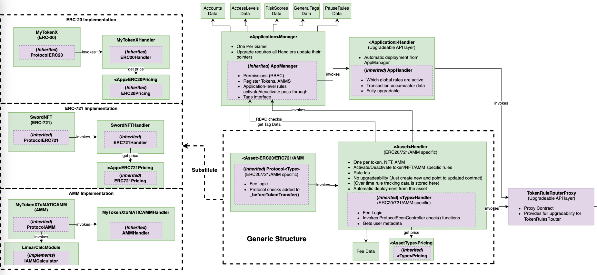

# Architecture Overview
[![Project Version][version-image]][version-url]

---

The following diagram outlines the general architecture of the protocol that may be shared on-chian. Every application
ecosystem may reuse these contracts. These contracts are also in a configuration that allows for upgradability.  

The following diagram outlines the architecture each individual application ecosystem must deploy and hook into the previous
Protocol architecture. This architecture is also upgradable and connects to the previous architecture
through the TokenRuleRouterProxy contract.

The following diagram outlines a sample deployment: 

   
<!-- These are the body links -->
[deploymentGuide-url]: deployment/NFT-DEPLOYMENT.md
[userGuide-url]: DEVELOPER-GUIDE.md
[ruleGuide-url]: rules/RULE-GUIDE.md
[glossary-url]: GLOSSARY.md

<!-- These are the header links -->
[version-image]: https://img.shields.io/badge/Version-1.0.0-brightgreen?style=for-the-badge&logo=appveyor
[version-url]: https://github.com/thrackle-io/Tron
