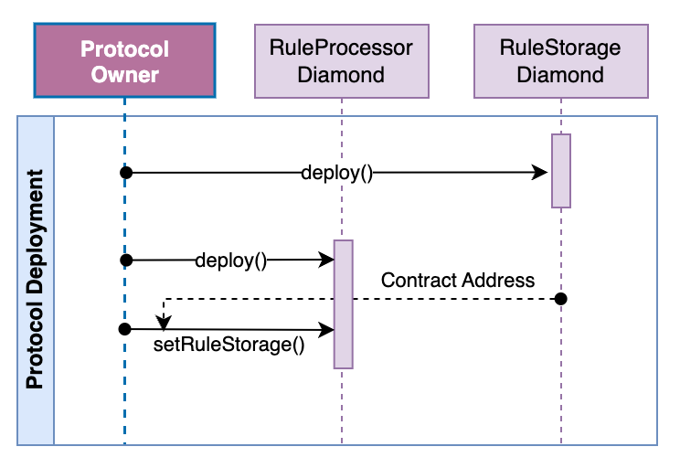

# Protocol Deployment
[![Project Version][version-image]][version-url]


---
Due to the architecture of the Protocol, several contracts are required to be deployed to utilize the protocol. Once these are deployed, 
several application ecosystems may utilize these contracts independently without affecting each other. The following diagram
is an overview of this deployment process:




1. Open a new terminal
2. Set the RPC URL
   1. Choose the RPC URL that corresponds with the desired environment.
   2. Export it to zsh
        ````
        export ETH_RPC_URL=http://localhost:8545
        ````
3. Set the Protocol Owner Address
   1. This is the account that will "own" all the protocol contracts and have full permissions to upgrade.
   2. Export it to zsh
        ````
        export LOCAL_DEPLOYMENT_OWNER=desired address
        ````
4. Set the Protocol Owner Private Key
   1. This is the private key for the account that will "own" all the protocol contracts. This should correspond to the Application Admin Address set in Step 2. NOTE: This account needs to have sufficient funds to cover deployment costs.
   2. Export it to zsh
        ````
        export LOCAL_DEPLOYMENT_OWNER_KEY=desired private key
        ```` 
5. In the same terminal as above, ensure that the Foundry installation is current
   ````
   foundryUp
   ````
6. In the same terminal as above, navigate to the cloned repo directory and run the build script
````
    forge script script/DeployAllModules.s.sol --ffi --broadcast --verify --rpc-url $ETH_RPC_URL
````

# *** UNDER CONSTRUCTION ***
- Take note of the output and locate the following addresses(from terminal output or broadcast/DeployAllModules.s.sol/31337/run-latest.json):
```
      "hash": "0x1902f5f3c6f2ed24ae3a64c8ddb41e72fb71b57c3404278c965dee920aa6f40f",
      "transactionType": "CREATE",
      "contractName": "RuleStorageDiamond",
      "contractAddress": "0x1613beB3B2C4f22Ee086B2b38C1476A3cE7f78E8"

```
3. Note the addresses for the following contract deployments
   1. RuleProcessorDiamond
   2. RuleStorageDiamond


<!-- These are the body links -->
[environment-url]: ./SET-ENVIRONMENT.md

<!-- These are the header links -->
[version-image]: https://img.shields.io/badge/Version-1.0.0-brightgreen?style=for-the-badge&logo=appveyor
[version-url]: https://github.com/thrackle-io/Tron